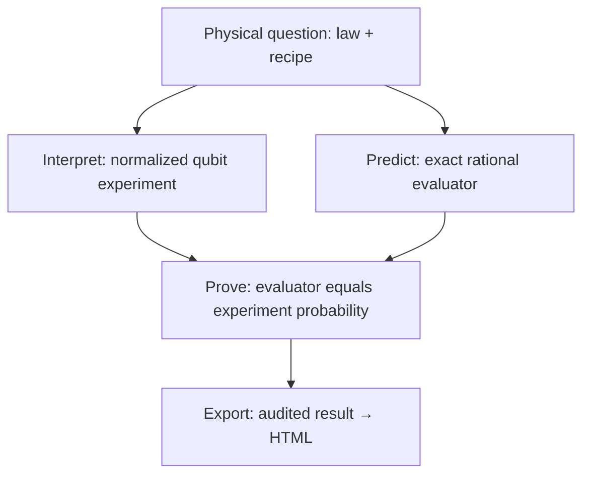

# Your first checked experiment

1. Describe a preparation, an ordered list of interventions, and a measurement.
2. Choose the physical laws to compare.
3. Export a table. Lean checks the connection between every number and that experiment.
4. Change a law or intervention and export again.

Start by opening [the finished example](../examples/recipe-comparison.html) locally.
It compares three dephasing laws against four experimental procedures.

## Set up once

Install [Lean using Elan](https://lean-lang.org/install/), then open a new terminal.
From this repository:

```sh
lake --version
lake exe cache get
python3 -m pip install -e .
```

`lake` is Lean's build tool. If it is missing, check that `$HOME/.elan/bin` is on
`PATH`. Elan selects the version in `lean-toolchain` (currently Lean 4.30.0).
The first run downloads Lean, mathlib and compiled dependencies; allow substantial
disk space and download time. Later builds reuse them. Duration depends on the
machine and network; there is no fixed timing guarantee.

## Create, check, open

```sh
ontology-separation new-scenario MyStudy -o examples/MyStudy.lean
ontology-separation scenario-report examples/MyStudy.lean -o examples/my-study.html
```

Open `examples/my-study.html`. No server is needed. The report command builds
current imports before checking the source; a separate `lake build` is unnecessary.
If you prefer not to install the Python client, replace `ontology-separation`
with `PYTHONPATH=python python3 -m ontology_separation.cli` from the repository root.

The generated file is a complete working experiment, not a skeleton with missing
proofs. It uses this API:

```lean
import OntologySeparation.Recipes
open OntologySeparation.Recipes

def comparison := compare "Coherence study"
  [Law.dephasing 0 1, Law.dephasing 1 2, Law.dephasing 1 1]
  [ { prepare := .plus, steps := [.expose], measure := .x },
    { prepare := .plus, steps := [.phaseFlip, .expose], measure := .x },
    { prepare := .plus, steps := [.hadamard, .expose, .hadamard], measure := .x },
    { prepare := .plus, steps := [.expose, .expose], measure := .x } ]

#export_scenario comparison
```

- `import` brings in the recipe API and checked exporter. `open` shortens names.
- `compare` takes a study title, a nonempty list of laws, and a nonempty list of recipes.
- `Law.dephasing 1 2` means p=1/2. Separate numerator/denominator arguments ensure
  even `0/0` is rejected. Rates above one are rejected too.
- Each recipe fixes the preparation, ordered interventions, and readout for **every**
  law. Only `.expose` uses the law's dephasing rate. The hardware procedure cannot
  silently change depending on which law is under test.
- `#export_scenario` checks dependencies and extracts exact rational predictions.
  Python renders that output as HTML; it does not supply the predictions.

Change `Law.dephasing 1 2` to `Law.dephasing 1 4` and run the report command again.
The generated parameter label changes too. One exposure now gives 7/8; two give
25/32. Try `Law.dephasing 3 2`: checking fails and no new report is published.
An existing HTML file remains the previous result, so heed the stale-report error.

## What the recipe means physically

The state is a real qubit with Bloch coordinates (x,z), x²+z² ≤ 1.

| Recipe element | Equation or preparation |
|---|---|
| `.plus` | (x,z) = (1,0) |
| `.zero` | (x,z) = (0,1) |
| `.expose` | (x,z) → ((1-p)x,z), with p from the selected law |
| `.dephase (Rate.fraction 1 2)` | Fixed channel (x,z) → (x/2,z) under every law |
| `.hadamard` | (x,z) → (z,x) |
| `.phaseFlip` | (x,z) → (-x,z) |
| `.x` readout | P(+) = (1+x)/2 |
| `.z` readout | P(+) = (1+z)/2 |

Operations run left to right. Repeating exposure composes the same memoryless
channel; it does not introduce an unmodeled bath memory. No operations means direct
measurement after preparation. A phase flip is the Pauli Z operation, not a Z measurement.
These exact rational laws form a restricted backend; Bell/LF and new physical
mechanisms use the broader interfaces described below.

## How a number becomes a checked result



`Recipes.probability_correct` proves this equality for **every** supported law and
finite recipe. `Recipes.probability_bounds` proves that the answer lies in [0,1].
The same proof applies to your new operation sequences; there is no table of
preselected answers. See [the design](design/CHECKED_RECIPES.md) for the implementation.

## Move beyond the starter

- **More procedures with these operations:** edit the recipe list. No new proof is needed.
- **A different physical law or a new measurement:** define a `Scenario` and prove
  its predictions using [the advanced scenario guide](ADD_A_SCENARIO.md). Extend
  the operation semantics and soundness theorem if building a reusable backend.
- **Bell/LF assumptions and bounds:** use the named physical vocabularies in the
  [physicist guide](PHYSICIST_GUIDE.md). An ontology label alone is not a law.
- **An independent project:** follow [the downstream instructions](../examples/downstream/README.md).
- **Terminology and assumption choices:** read [the glossary](GLOSSARY.md).

## What checking establishes

Lean verifies the stated mathematics. It cannot establish that a chosen definition
is the right physics or that a model fits experimental data. A bound on a class
alone does not prove that the class contains a model. `RealizedProfileBound` pairs
that bound with a model satisfying its exact profile; this proves nonemptiness,
not that the model occurs in nature or attains the bound.

The recipe API derives axis labels from the actual parameters and interventions,
and rejects empty comparisons and duplicate labels. The advanced API accepts
user-written descriptions, which still need human review. Editable HTML/JSON is
not an authenticated proof certificate: recheck trusted Lean source.

Export commands automatically audit their transitive dependencies against the
allowed logical axioms. `Tests/Audit.lean` additionally lists selected audit roots;
it is not a complete list of every declaration an adopter might add. Build and
export each new study, and run `sh scripts/check.sh` for this repository's full gate.
