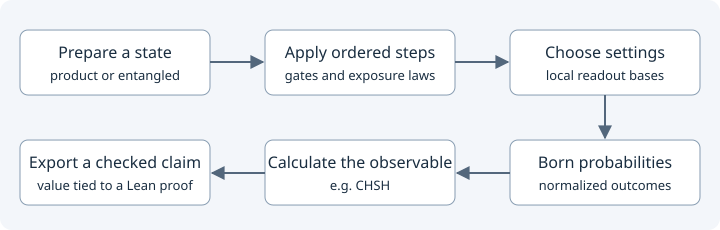

# Getting started

Create a small experiment, compare three physical laws, and get a table of
**Lean-checked predictions**. You do not need to write a proof for the supported recipes.

## Browse first — no Lean required

Open the [online explorer](https://stevenwarejones.github.io/ontology-separation/)
(after its first Pages deployment), or download this repository and open
`examples/index.html`. No installation is needed to view exported results.

With Python alone, you can install the client, browse bundled results with
`ontology-separation compare B01 B02`, and create a starter file with `new-scenario`
inside a checkout. **Checking that file or generating new verified predictions
requires Lean.** Reading a snapshot does not recheck its proofs.



## 1. Set up once

You need Git, Python 3.10+, and [Lean installed through Elan](https://lean-lang.org/install/).
Open a new terminal after installing Lean. These commands use a macOS/Linux shell:

```sh
git clone https://github.com/stevenwarejones/ontology-separation.git
cd ontology-separation
python3 -m venv .venv
source .venv/bin/activate
python -m pip install -e .
lake exe cache get
```

Already cloned it? Start with `cd` into that checkout. The first Lean/cache download
can take tens of minutes depending on downloads and hardware; subsequent runs reuse it.
Run `ontology-separation doctor` to inspect setup without triggering a build or download.
It checks tool availability and a sample cache file, not live build progress. If `lake` is missing, add
`$HOME/.elan/bin` to your `PATH` and reopen the terminal.

## 2. Create and run an experiment

```sh
ontology-separation new-scenario MyStudy -o examples/MyStudy.lean
ontology-separation scenario-report examples/MyStudy.lean -o examples/my-study.html
```

Open **`examples/my-study.html`** in your browser. You should see three laws × four
procedures: **12 exact predictions**. No web server is needed.

The generated Lean file specifies the preparation, ordered operations, measurement,
and dephasing rates. The framework supplies the predictions and their proofs.

## 3. Change one law

In `examples/MyStudy.lean`, change **`Law.dephasing 1 2`** to **`Law.dephasing 1 4`**.
Then run the report command again:

```sh
ontology-separation scenario-report examples/MyStudy.lean -o examples/my-study.html
```

Refresh the HTML. The parameter label becomes **p=1/4**; one exposure gives **7/8**
and two exposures give **25/32**. The command rebuilds changed imports automatically.
If checking fails, it leaves the previous report intact and warns that it may be stale.

## Where to go next

- [Understand every line and its physical meaning](RECIPE_GUIDE.md).
- [Build a two-qubit Bell experiment](TWO_QUBIT_GUIDE.md).
- [Define a new law package: the Bell example](ADD_A_SCENARIO.md).
- [Browse the HTML examples](../examples/index.html) or [look up a term](GLOSSARY.md).

Lean checks the mathematics relative to your definitions. Choosing definitions
that describe the intended physical experiment remains part of the scientific work.
