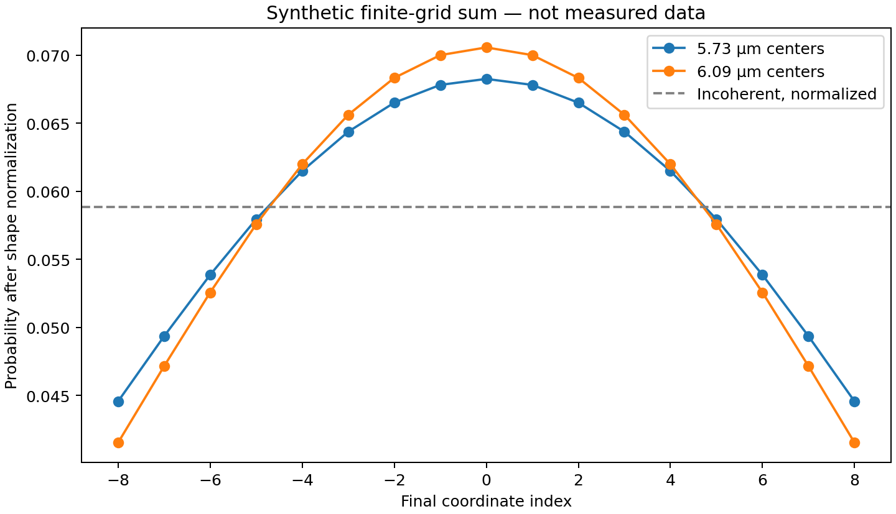

# Photon path-integral audit

**Status: method audit and exact finite model completed; empirical replication blocked by data access.** This is work package 3 of the path-reality investigation. The paper and full supplement were read. The 19-file Dryad manifest is pinned, but no spreadsheet bytes have been obtained: the API returns 401, public file links and archive-information endpoint return 403. A metadata listing is not a dataset replication. Updated 2026-09-26 UTC (September 25 in New York).

## Finding relevant to ontology-separation

This experiment compares an independently recorded endpoint distribution with a distribution reconstructed by coherently combining inferred propagators. That can test a concrete consistency relation and discriminate against a specified incoherent-addition rule. It does **not** discriminate between a path-integral representation and a wave-evolution representation that predict the same probabilities. Nor does rejection of incoherent addition reject every model with definite outcomes or trajectories.

The most useful next experimental step is to specify an alternative with different **observable** predictions, together with the access and calibration assumptions that make the difference testable. Adding contextuality controls is a promising work-package-2 direction. A claim about superluminal or backward-time causal influence requires the separate intervention-based design of work package 1.

The accompanying Lean model proves these logical distinctions in a small ideal example; it does not formalize the Wen apparatus or certify its empirical results.

**Repository scope:** keep the work here while it compares universes/model classes through explicit observable predictions. Package related audit code, formal certificates, tests and documentation in one cohesive PR. If standalone instrumentation or general data-analysis tooling becomes the main purpose, propose a focused repository (as with forced-signaling) before moving it. Current scope remains ontology checking.

## Sources and provenance

- Wen et al., Science Advances 12, eaeh1011 (2026), [paper DOI](https://doi.org/10.1126/sciadv.aeh1011), [PMC text](https://pmc.ncbi.nlm.nih.gov/articles/PMC13510607/), [Europe PMC XML](https://www.ebi.ac.uk/europepmc/webservices/rest/PMC13510607/fullTextXML).
- [Supplement archive](https://www.ebi.ac.uk/europepmc/webservices/rest/PMC13510607/supplementaryFiles), containing `sciadv.aeh1011_sm.pdf`, 20 pages. Sections 6–8 explain extraction, noise simulation and endpoint grouping. PDF page 4 was visually checked against text extraction.
- [Dryad dataset](https://doi.org/10.5061/dryad.x0k6djj14), version 3, version ID 450489; CC0. `manifest.json` preserves filenames, sizes, download URLs and author-repository SHA-256 values. Those hashes describe expected originals, not locally verified downloads.
- `provenance.json` records locally acquired source hashes, URLs, retrieval date and repository base commit. Paper/supplement originals remain ignored under `raw/`; paper license is CC BY-NC 4.0.
- [Literature search log](literature-search-log.md) records five checkpoints, primary sources, failed searches, and consequences. [Question register](open-questions.md) preserves blockers and next actions.

## Inferential chain and assumptions

Let the measured transverse positions be indexed by i and the successive longitudinal slices by k. In the effective paraxial theory, time is t=z/c. A complex matrix entry Kₖ(b,a) represents propagation from a to b over one slice. This is already a model-dependent inferred quantity, not a detector click labeled with a path.

1. Camera signals in four polarization bases supply intensity differences. Converting grayscale to these unnormalized pointer bilinears requires exposure, gain, background and source normalization. Normalized Stokes parameters alone omit the postselection probability.
2. The optical measurement equation divides a complex combination of those differences by a reference wave amplitude and a preparation factor. Its validity depends on the pointer interaction, reference phase, finite slit/imaging response and approximations in the paraxial model.
3. For a discrete history j=(x₁,…,x₅), the reconstruction assigns φⱼ=∏ₖKₖ(xₖ,xₖ₋₁). These factors generally come from different experimental settings and ensembles. This product is not a sequential record of one undisturbed photon.
4. Endpoint weights are formed as Q(b)=|∑ⱼ→ᵦφⱼ|²; the comparator is C(b)=∑ⱼ→ᵦ|φⱼ|². Measured E(b) supplies a separate endpoint comparison. Born readout and reconstruction assumptions remain part of the test.

The experiment can therefore be informative without being assumption-free. Calling the entire result circular would ignore the independent endpoint acquisition. Calling the reconstructed paths individually observed would ignore the reconstruction assumptions.

**Loss and conditioning:** the displayed interaction in main Eq.12 includes a projector. A successful filtered branch may legitimately be trace-decreasing and embedded in a complete quantum instrument with a failure outcome. It should not silently be treated as a deterministic unitary on the displayed degrees of freedom. The raw records are needed to audit the precise conditioning and absolute rates.

## An explicit equivalence derivation

For any finite intermediate basis, ordinary transfer evolution gives

\[
(K_5K_4K_3K_2K_1)_{b,a}
=\sum_{x_1,x_2,x_3,x_4}
K_5(b,x_4)K_4(x_4,x_3)K_3(x_3,x_2)K_2(x_2,x_1)K_1(x_1,a).
\]

The right side is the finite path sum, by the definition of matrix multiplication. The left side requires no assertion that every summation index describes an occupied worldline. Applying the same detector rule gives identical probabilities. Testing more accurately cannot distinguish these representations unless an additional ontological hypothesis changes a measurable prediction.

For the free transverse Hamiltonian H=p²/(2m), Fourier evolution gives the familiar Gaussian oscillatory kernel proportional to exp[im(b−a)²/(2ℏΔt)]. Multiplying fixed-time kernels yields a constant magnitude and the summed discrete action in the phase. Thus these features also follow in the wave representation. The overall measure/prefactor matters; equal magnitude is not a universal claim about every coarse-grained history or arbitrary action.

**Finite-window bridge still required (Q18):** replacing complete intermediate identities with a bounded coordinate window inserts projections P: the corresponding operator is K₅PK₄P…PK₁, not unrestricted K₅…K₁. A finite-grid approximation must justify omitted paths, quadrature weights, initial wavepacket and physical apertures. The unrestricted free position-to-position kernel has constant endpoint magnitude, whereas a truncated sum can be curved. Therefore a match to a finite-grid curve does not alone establish the unrestricted propagator composition law. The descriptions read so far do not settle this preparation/window bridge. This is a concrete calibration/model question, not an allegation that the observed data are wrong.

## What can be compared

| Model or claim | Operational content | Status from this audit |
|---|---|---|
| Coherent path reconstruction | Square the sum of inferred amplitudes | Reported comparison; numerical reproduction pending |
| Same transfer/wave evolution | Multiply the same transfer matrices and apply the same detector rule | Algebraically identical on this interface |
| Specified incoherent history sum | Sum squared amplitudes, with declared normalization and calibrations | Potentially distinguishable; empirical significance not recalculated |
| Arbitrary context-dependent response model | Probabilities may depend on the complete selected setting | A finite matching response is explicitly constructed in Lean; no general exclusion follows |
| A specified definite-trajectory theory | Must define preparation, dynamics, measurement response and disturbance | Not automatically identified with incoherent addition; no theory-specific exclusion asserted |
| A retrocausal interpretation reproducing the same tables | Identical public predictions under allowed controls | Not separated by those tables; changing conditional explanations is insufficient |
| Controllable FTL/backward-time influence | A change in an earlier/spacelike marginal under a later/remote intervention | Not the measured observable here |

The finite contextual emulator is a counterexample to a sweeping inference, not a complete physical theory of photons. Likewise, algebraic equivalence of the two representations does not prove all interpretations equivalent under every conceivable experimental intervention.

## Uncertainty and effective information

There are 17⁵=1,419,857 discrete histories but only 17⁴=83,521 per fixed endpoint. A full five-slice tensor has 1,445 complex entries; with fixed starting coordinate only 1,173 distinct entries are used. This counts entries, **not independent trials**. Camera pixels, backgrounds, common source normalization, phase reference and repeated scans can correlate those entries.

If a nonzero path product uses entries e with multiplicities nⱼₑ, its first-order relative perturbation is

\[
\delta\phi_j/\phi_j=\sum_e n_{je}\,\delta K_e/K_e.
\]

For the real vector of complex-entry components, the covariance propagates as JΣJᵀ to first order. An endpoint sum can exhibit cancellation, making relative-error linearization unstable near zeros. Prefer resampling complete independent acquisition blocks and shared calibration draws through the entire reconstruction, or a justified full likelihood. Do not bootstrap millions of path labels as independent data. Use absolute residuals near zeros.

A comparison of E and Q requires Cov(E−Q)=Cov(E)+Cov(Q)−Cov(E,Q)−Cov(Q,E). Marginal error bars cannot determine this matrix. Treating SD bands over a population of reconstructed histories as standard errors of independent measurements would be a category error. A confidence interval, likelihood ratio or Bayes factor cannot be reconstructed merely by inventing photon counts for processed arbitrary-unit tables.

If arbitrary-unit arrays are separately area-normalized, compare shapes and propagate the normalization covariance. Also report absolute-rate comparisons only when common calibration supports them. A visually good shape fit does not certify normalization, detector efficiency or the model assumptions.

## Reporting discrepancies and resolved false alarms

- The reported 4.45% statistic compares reconstructed Q with theoretical Q, not directly E with reconstructed Q. Recompute both pairs separately once spreadsheets are available.
- The abstract/introduction summary gives postulate-I fidelity 94.9%, whereas Results gives 94.4%. Both are retained as published; the correct underlying calculation is unknown.
- In XML equation m136, the displayed fidelity denominator squares both self-inner-products. For unnormalized vectors the scale-invariant expression is |⟨u,v⟩|²/(⟨u,u⟩⟨v,v⟩). Scaling u by a nonzero factor demonstrates why the printed expression needs clarification. If the vectors were first normalized, the distinction disappears. No error in the actual author computation is established.
- A missing square root in the trace-distance expression was an extraction artifact: MathML m203 contains `msqrt`. That criticism was checked and rejected.
- The stated 5.73 μm step and ±48.72 μm window may be reconciled if the latter are bin edges (8.5 steps), rather than centers at ±8 steps. Do not assume an error without checking coordinates.
- Phase averages require explicit reference and wrap conventions; action outside the displayed interval must be included, wrapped, or excluded by a documented rule. Source code and per-path inputs are needed to reproduce this faithfully.

**Additional conditional calculation (Q19):** for the full-line normalized 1D Gaussian ψ(x)∝exp[−x²/(2a²)] under free paraxial propagation over f, let β=λf/(2πa²). Integrating its Gaussian momentum distribution gives |⟨ψ,Uψ⟩|²=(1+β²/4)⁻¹ᐟ², hence D=√[1−(1+β²/4)⁻¹ᐟ²]. The stated a=0.57 mm, λ=795 nm and f=25 mm give D≈0.00344. This does not match the printed bound <3.41×10⁻⁶ under that full-line reading. A restricted, renormalized measurement-window state can give a different answer; the exact domain/normalization must be clarified before diagnosing a calculation error. The square-root *formula* itself was not missing.

## Independent numerical checks

`synthetic_checks.py` uses no measured workbooks. It enumerates the full finite grid, compares route enumeration with direct matrix composition on independently generated complex matrices, and investigates documented noise magnitudes using eight declared seeds. Results are in `results/synthetic.json`.

- Matrix composition agrees with explicit route summation to 1.8×10⁻¹⁵ in the numerical cross-check. The underlying identity is algebraic; this floating-point check only validates implementation.
- The two plausible center-spacing conventions yield normalized endpoint shapes with total-variation distance 0.01380. This quantifies a sensitivity, not a measured discrepancy.
- With 5.73 μm centers, 0.1731% of paths have classical-reference-subtracted action at least 2πℏ; with 6.09 μm it is 0.5615%. A [0,2πℏ) grouping therefore requires a rule for these histories under this implementation.
- Independent entry noise at the supplement's stated standard deviations produces within-path-population symmetric errors of 17.28–18.92% across seeds. This is consistent in scale with the paper's noise explanation; it does not reproduce its seed, raw observations or covariance.
- The independent-segment phase-error prediction is √5×0.0459π=0.10264π. Common calibration errors behave differently: a 5% gain error on each segment multiplies every path weight by 1.05¹⁰≈1.629 while leaving within-run weight uniformity exact. Thus uniformity alone does not validate absolute calibration.



All probabilities in this figure are normalized within the finite computational endpoint window. These are not absolute detector probabilities or a continuum-limit demonstration.

## Formal certificate and its limits

`OntologySeparation/Experiments/PathInterference.lean` defines two routes and two phase settings. The route amplitudes are ±1/2; both outputs are retained and normalized. It proves:

1. coherent path addition and the elementary transfer formula agree on every entry;
2. each independently populated route gives a fair detector distribution, so every preparation mixture of those routes obeys the 1/2 success bound;
3. the coherent ideal output reaches probability 1 and excludes that entire defined incoherent class;
4. a deterministic response depending on the selected setting matches the coherent table and belongs to an explicitly enlarged response class;
5. dephased access erases the separator, while interference access provides an exact gap of 1/2.

`Tests/PathInterference.lean` checks the nonempty null class, matching countermodel and impossibility of a separator under restricted access. Roots are registered in `Tests/Audit.lean`. `examples/PathInterferenceStudy.lean` exports the checked theorems through the repository's standard proof reporter.

No rounded experimental value enters a theorem. There is no checked bridge from grayscale calibration to a quantum instrument, from this ideal two-route example to the 17-position apparatus, or from the excluded class to all possible ontologies. These are explicit scope boundaries, not inferred theorems.

## Reproduce and resume

Use the repository's pinned Lean toolchain. Python numerical/extraction scripts need NumPy, Matplotlib, Pillow (Matplotlib dependency), and openpyxl; the tested versions are recorded in `results/validation.md`.

```sh
python research/path_integral_audit/fetch_data.py
python research/path_integral_audit/fetch_data.py --verify-only
python research/path_integral_audit/extract_workbooks.py
python research/path_integral_audit/synthetic_checks.py
sh scripts/check.sh
```

The downloader stops requests after an access-control response and exits 2 if any original is unavailable. Authorized user-supplied files may be placed in `raw/`; the same digest checks apply. Extraction verifies the complete workbook set before exporting all sheets, including hidden sheets, formulas and cached values. **Actual workbook extraction has not been exercised because the originals are missing.** Syntax checks do not establish spreadsheet-layout correctness.

After acquisition: verify all sheets against [data-dictionary.md](data-dictionary.md), implement the actual column mapping, reproduce Figure 3 and 4 with original units, compute E/Q and Q/theory residuals separately, inspect phase/bin/normalization conventions, then reconstruct at the propagator level if the full tensor is present. If it is absent, request the exact materials listed in the question register. Do not substitute processed means for missing raw repetitions.

## Completion audit

| Requirement | Evidence | Disposition |
|---|---|---|
| Current repo and source provenance | Base commit, manifest and source hashes | Complete for acquired sources |
| Paper plus supplement review | Inferential chain, source-linked issues Q02–Q14 | Complete method audit; apparatus clarifications remain |
| Full public-data replication | Downloader, all-sheet extractor, manifest | **Blocked: 19 originals inaccessible** |
| Independent analytical checks | Composition identity, conditioning/covariance derivations | Complete within stated assumptions |
| Numerical diagnostics | Reproducible synthetic grid/noise results | Complete synthetic work; no empirical fit claimed |
| Alternative models | Explicit comparison table and exact countermodel | Complete for declared finite classes |
| Formal verification | Lean proofs, counterexamples, audit roots, standard export | See validation record |
| Repeated literature checks | Five logged checkpoints plus limitations | Complete current-source pass; refresh before empirical conclusions |
| Every open question accounted for | Q01–Q20 with evidence/dependencies/next steps | No silent abandonment; blocked questions remain open |

The practical next dependency is obtaining the original data, not making a stronger ontological claim from the current plot.
